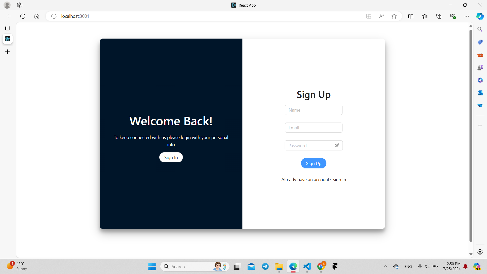
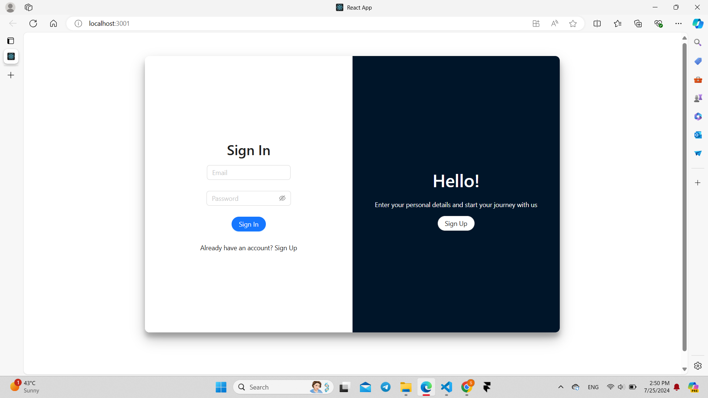

# Todo Management

## Overview

This project is a Todo Management built with React and Ant Design. It allows users to manage their tasks efficiently with features for authentication, profile management, and todo list handling.

## Features

### User Authentication
- **Sign Up**: Easily create a new account to start managing your tasks.
- **Sign In**: Securely log in to access your personalized todo list.

### Profile Management
- **View Profile**: Check your profile information at any time.
- **Edit Profile**: Update your name, email, and password for a personalized experience.

### Todo List Management
- **Add Tasks**: Quickly add new tasks to keep track of your to-dos.
- **Delete Tasks**: Remove tasks that are no longer needed.
- **Set Priority**: Prioritize your tasks to focus on what's most important.
- **Set Due Date**: Keep track of deadlines by assigning due dates to your tasks.

### Persistent Data
- **Local Storage**: Your data is stored locally, ensuring your tasks and profile information are always available even after you log out.

## Screenshots


*SignUp Page*


*SignIn Page*


*Task Page*


*Profile Page*

## Installation

To install and run this project locally, follow these steps:

1. **Clone the repository:**

   ```bash
   git clone https://github.com/your-username/your-repository.git
   cd your-repository
   ```

2. **Install the dependencies:**

   ```bash
   npm install
   ```

   This project requires the following dependencies:

   - `antd` (version ^5.19.3): A design system for enterprise-level products.
   - `moment` (version ^2.30.1): A library for handling dates and times.
   - `react` (version ^18.3.1): A JavaScript library for building user interfaces.
   - `react-dom` (version ^18.3.1): React's DOM renderer.
   - `react-router-dom` (version ^6.25.1): Routing library for React applications.
   - `react-scripts` (version 5.0.1): Scripts and configuration used by Create React App.

3. **Start the development server:**

   ```bash
   npm start
   ```

   This will start the application and open it in your default web browser.

## Contact

For any questions or feedback, please contact (sara.yassen727@gmail.com).
